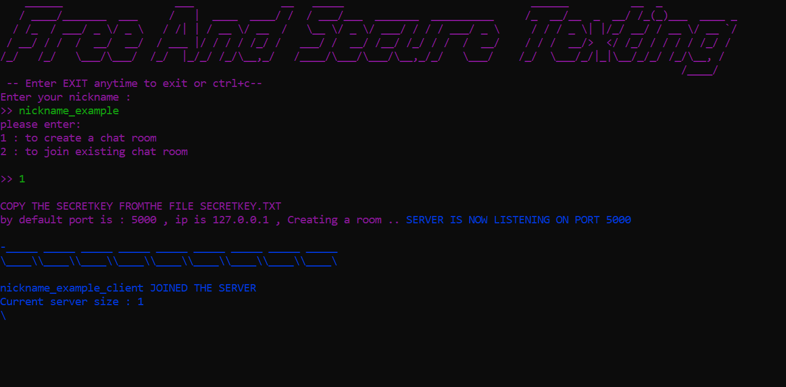

<!-- PROJECT LOGO -->
<p align="center">
  <a href="https://github.com/AbidAbed/Free_And_Secure_Texting">
    
  </a>

  <h3 align="center">Free And Secure Texting</h3>

  <p align="center">
    A secure and privacy-focused messaging application
    <br />
    <a href="https://github.com/AbidAbed/Free_And_Secure_Texting/docs"><strong>Explore the docs »</strong></a>
    <br />
    <br />
    <a href="https://github.com/AbidAbed/Free_And_Secure_Texting/tree/master/images">View Demo</a>
    ·
    <a href="https://github.com/AbidAbed/Free_And_Secure_Texting/issues">Report Bug</a>
    ·
    <a href="https://github.com/AbidAbed/Free_And_Secure_Texting/feature">Request Feature</a>
  </p>

<!-- TABLE OF CONTENTS -->
## Table of Contents

* [About the Project](#about-the-project)
  * [Built With](#built-with)
* [Getting Started](#getting-started)
  * [Prerequisites](#prerequisites)
  * [Installation](#installation)
* [Usage](#usage)
* [Roadmap](#roadmap)
* [Contributing](#contributing)
* [License](#license)
* [Contact](#contact)

<!-- ABOUT THE PROJECT -->
## About The Project

[![Product Name Screen Shot][product-screenshot]](https://github.com/AbidAbed/Free_And_Secure_Texting/images/server_sends_a_message.png)

Free And Secure Texting is a messaging application designed with a focus on security and privacy. The application allows users to send encrypted messages END-TO-END encrypted , ensuring their communication remains confidential. It provides a user-friendly interface and advanced security features to protect user data.no databases are used at all , means whatever you sends flies away with no coming back.
the encryption algorithm used is "AES"-265.

### Security ?
every message is encrypted using he SECRETKEY provided in the SECRETKEY.txt before it's being sent (whether it's being sent by client or server)
and every message being received is decrypted using the SECRETKEY provided in the SECRETKEY.txt (to read an understandable humen's ,
every client should use the server's secretkey for all sending and receiving messages)

### How it works?
you choose your nickname at first , after that,
you choose if you will host a room (aka a server socket) or as a client (socket),
now after that  , the server starts listening on "127.0.0.1:5000" and whenever a client sockets sends a message ,
it validates it , and it should be exactly as : 'nickname':'YOUR-NICKANME' , after that , if it does match this form it adds it to 
an array of clients (the first message must be encrypted using the server key),now the server creates 2 threads (for read-writing on client op)
for each client in the array one it's job to wait messages to be received and another to send to the associated client 
, after the second thread reads the message it's set a broadcasting-message and broadcasts it to every sending-client-thread 
in the client array which is how broadcasting happens. at client side , each client has 2 threads (for read-writing on server op), one
for waiting input from server to display , the other one  for sending the messages for the server

### Important note

1. when client hits enter after typing a message , the message is being shown like : "nickname:hi" , is displayed after it's 
  being received from the server

2. you must follow the guideline to avoid any type of error

3. when you paste the secretkey , don't add a new line or even a space 

4. once you use a room , make sure to paste exactly as the following with no space addtion or anything else : domain:port

5. make sure that the messages is being forwarded to port 5000 on your local machine

## you should know : 

1. green colored text means something you wrote

2. red colored text means something bad (error , no body likes it)

3. magenta colored text means system output

4. yellow colored text means message you received 

### Built With

* [Java](https://www.java.com/en/)

<!-- GETTING STARTED -->
## Getting Started

To get a local copy up and running, follow these simple steps.

### Prerequisites

Make sure you have the following installed:
* java jdk 19 

### Installation

1. Clone the repository
   ```sh
   git clone https://github.com/AbidAbed/Free_And_Secure_Texting.git
   ```
2. Enter Free_And_Secure_Texting/target
  ```sh
    cd target
  ``` 
3. Extract the target.rar

4. Create a .txt file named exactly "SECRETKEY" or copy the following command in the directory /target (THE FILE MUST BE THERE)
    ```sh
      type nul > SECRETKEY.txt
      
5. run the following in the terminal :
    ```sh
    java -jar Free_AND_Secure_Texting-0.1.0-SNAPSHOT.jar
    ```

<!-- USAGE EXAMPLES -->
### Usage
# You can use it as a client or as a server.
# as a start , you must pick a nickname whether you are a server or a client


# then you choose to host a 'room' or to connect to an already hosted 'room'


1. As a server :
  # server waits for people to join the room , normally server's room is hosted locally only , so to make it 
  # available anywhere you can use ngrok tool or something similar , once you do , copy the "domain:port" and sends them 
  # to whoever want to join your room , also make sure that the ngrok or similar tool forwards messages to port 5000 on your machine 
  # , since the server listens to connections on that port only 


  

  # after each connection or room joining , a message should appear to the server as the following :

  
  
2. As a client : 
  # client should copy the SECRETKEY from the server , (which the server obtains it from the SECRETKEY.txt file after
  # starting to listen on port 5000) ,then the client should place the copied SECRETKEY into that file created before 
  # which is named "SECRETKEY.txt" , after that , hit enter in the console 

   

  # the client should enter the room number , which must follows the following : 
    -- ip:port
    # OR
    -- domain:port
  # after that hit enter and you should join the room if the server is already up and running

  

  # after a join you should receive the following message : 
  # "<><> "+YOUR-NICKNAME+" JOINED THE SERVER <><>"+"<><> Current server size : "+#-OF-CLIENTS-IN-THE-ROOM+"<><>\n"

  # after that the communication can start between the server and all clients and vise versa


#
<!-- ROADMAP -->

### Roadmap
See the open issues for a list of proposed features (and known issues).

<!-- CONTRIBUTING -->
### Contributing
Contributions are what make the open-source community such an amazing place to learn, inspire, and create. Any contributions you make are greatly appreciated.

1. Fork the Project
2. Create your Feature Branch (git checkout -b feature/AmazingFeature)
3. Commit your Changes (git commit -m 'Add some AmazingFeature')
4. Push to the Branch (git push origin feature/AmazingFeature)
5. Open a Pull Request


<!-- LICENSE -->
### License
Distributed under the MIT License. See LICENSE for more information.


<!-- CONTACT -->
### Contact
Abid Abed 

Project Link: https://github.com/AbidAbed/Free_And_Secure_Texting
